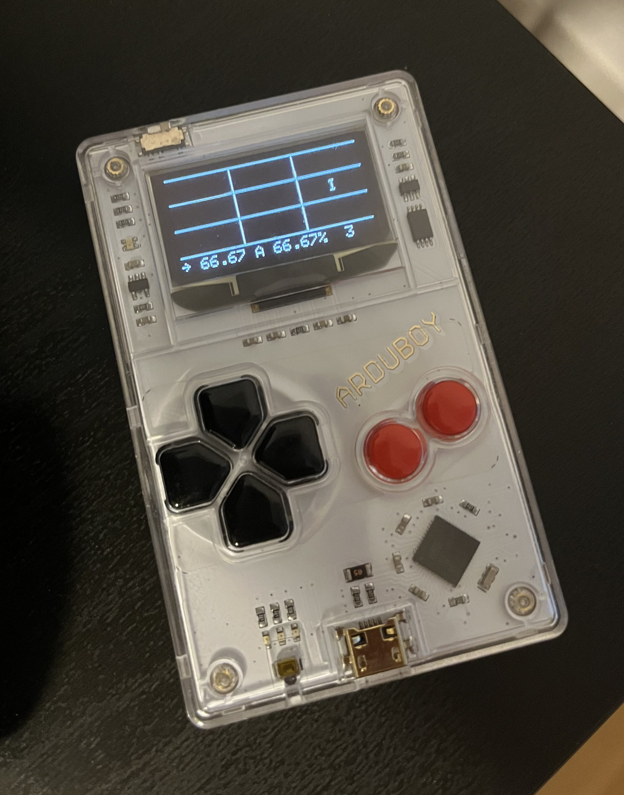
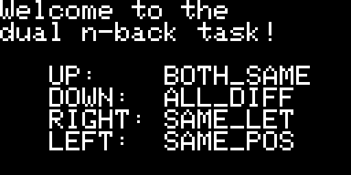
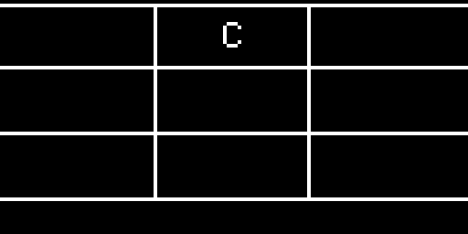
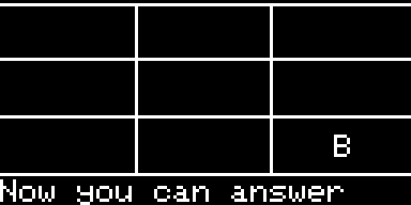
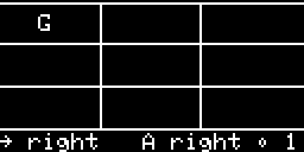

# ardu-n-back

A straightforward, text-only implementation of the dual [N-back task](https://en.wikipedia.org/wiki/N-back) for the [Arduboy](https://www.arduboy.com). 

Uses `N=2` (hardcoded) and position + letter for the questions.

You can try it in an online emulator [here](https://felipemanga.github.io/ProjectABE/?url=https://raw.githubusercontent.com/rberenguel/ardu-n-back/main/build/arduino.avr.leonardo/ardu-n-back.ino.hex).

# Screenshots

### Welcome screen. Press any button to continue

### Until there are enough "look backs", press any button

### As soon as you need to start remembering you'll be prompted

### Once you start answering you'll get stats for position & letter

## TODO

- [x] Add a picture or something to the README
- [ ] Clarify the state machine, I think there's a gap
- [ ] Make N customizable in-game
- [ ] Store scores/settings/something
